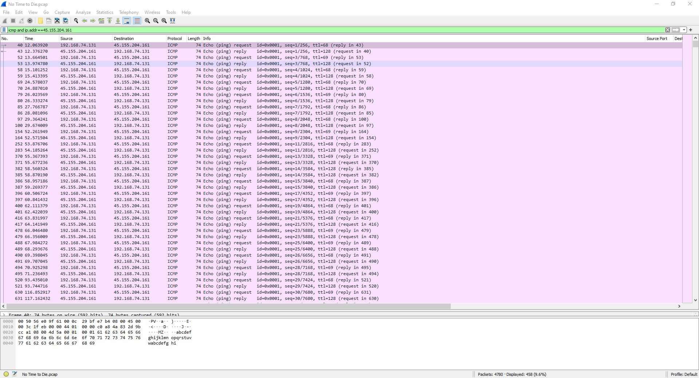
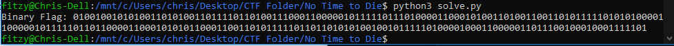
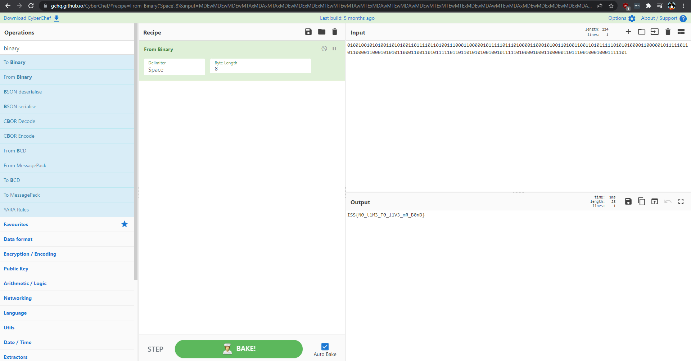

# Challenge

**Name:** No Time to Die  
**Category:** Forensics  
**Difficulty:** Medium  
**Author:** Chris Fitzsimons (Fitzy)  
**Flag:** ISS{N0_t1M3_T0_l1V3_mR_B0nD}  

## Description

A Bond villan has compromised one of the British Secret Intelligence Service's Servers and is Exfiltrating Secret Agent Data! Help 007 and Q find out how they are exfiltrating the data.  

## Solution

The Flag has been converted into binary and being exfiltrated over ICMP (ping). The TTL has been manually set to send 68 as 0 and 69 as 1. But there is a bunch of dummy data in the packet capture aswell.  
You can open the packet capture and filter out to only ICMP. You can then export this data which has been filtered and sorted into a csv file.  
With the CSV file you can go through each like and append 68 as 0 and 69 as 1. You can then convert this binary back to a string to get the flag.  
See solve.py to show how you can convert the export csv to the binary flag with python.  
You can either code the binary to string conversion or go it in cybercheff.  

