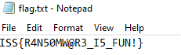

# Challenge

**Name:** Where Did My Files Go  
**Category:** Forensics  
**Difficulty:** Hard  
**Author:** David Dreher  
**Flag:** ISS{R4N50MW@R3_I5_FUN!}  

## Description

Something happend to our very important files. Can you recover it from this memory dump. We think they might have ransomware ...  
**Disclamer** THIS CHALLANGE CONTAINS MALWARE. Please handle with care.  

## Solution

1: identify windows host profile in volatility  
```bash
volatility -f Windows-host.dmp imageinfo
```
Output shows recommended profile as Win7SP1x64  
  

2 check a list of running processes  
```bash
volatility -f Windows-host.dmp --profile=Win7SP1x64 pslist
```
  

3: identify any suspicious processes  
  

4: dump the process for further analysis  
```bash
volatility -f Windows-host.dmp --profile=Win7SP1x64 procdump --pid=592 -D <folder>
```

5: Gather some intel on the file  
5a: file executable.592.exe # get file type  
  
Output indicates a .NET assembly which can be decompiled with dotpeek or ILSpy  

5b: scan the file with AV to find out if its malicious  
  
Clamav detects ransomware  

5c: decompiling using dotpeek reveals several details about the file  
  
The file has an embedded C2 URL  
  
The added file extension is .crypt  
  
Some info about the encryption methods  
  

6: search for the c2 communications containing the password  
A string search for the C2 page works, there are probably better ways of doing this  
  
The base64 encoded string can be decoded for the password  
  
Encryption password: zG=/Jx4VJrd9C5bqrKgmNBcpMIv!fSct*36vsBrA  

7: find the flag  
There are a few ways to find the flag:  
7a search for files with the .crypt extension identified during decompilation  
Dump the process memory for the ransomware executable and search for the crypt extension  
```bash
volatility -f Windows-host.dmp --profile=Win7SP1x64 memdump --pid=592 --dump-dir=<folder>
```
  
The file was opened in notepad and can be found using the cmdline module  
```bash
volatility -f Windows-host.dmp --profile=Win7SP1x64 cmdline
```
  

The flag can be found using filescan which provides the offset of the file  
```bash
volatility -f Windows-host.dmp --profile=Win7SP1x64 filescan | grep "My very nice flag.txt"
```
  

8: extract the flag  
The flag can be extracted using dumpfiles and the offset from the previous step  
```bash
volatility -f Windows-host.dmp --profile=Win7SP1x64 dumpfiles -n -Q 0x000000003f6d86f0 -D <folder>
```
  
The output file is the encrypted flag  
  

9: Decrypt the flag  
There are a few ways to do this  
The encryption function can be reverse engineered and decrypted with the key  
A google search for the AV detection will show that a free decrypted for this strain of ransomware exists already  
https://www.bleepingcomputer.com/ransomware/decryptor/how-to-decrypt-hiddentear-ransomware-variants/  
download the decryptor and rename the flag to its original name  
enter the info into the decryptor  
  
If the flag does not decrypt, the file may need to be cleaned up by removing the NULL bytes  
  
Once the null bytes have been removed the flag decrypts  
  
  

## Unintended Solution

Unfortunately, we forgot to double check that you could not get the flag using `strings` and `grep`.

```
strings Windows-host.dmp | grep 'ISS{'
ISS{R4N50MW@R3_I5_FUN!}
```

If you solved the challenge this way, we **highly recommend** you to try and do it the intended solution since it a extremely good tutorial about `volatility` for forensics.