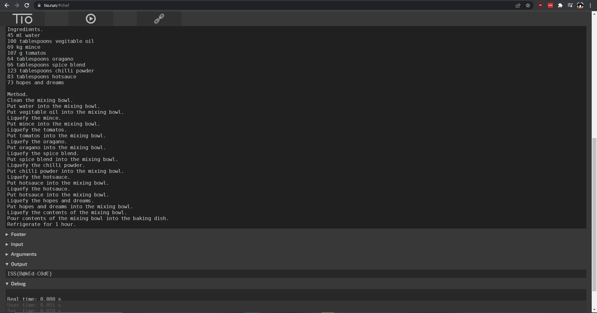

# Challenge

**Name:** My Name Chef  
**Category:** Misc  
**Difficulty:** Medium  
**Author:** Chris Fitzsimons (Fitzy)  
**Flag:** ISS{B@kEd-C0dE}  

## Description

This is a Master Cheffs secret recipe. Can you find out what the hidden ingrediant is?

## Solution

This is a recipie and code. This is a language called Chef. It uses ingrediances as variables and the method is the way it handles the values.  
You can either find out what each value is and put it together manually or run it in https://tio.run/#chef.  
When you run the code you will get the fag.  

