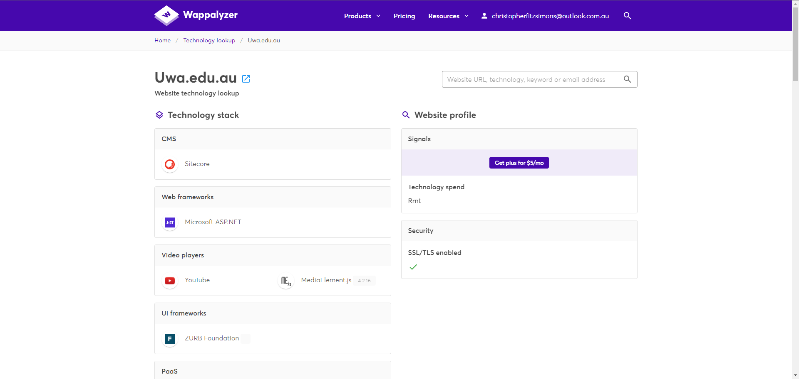
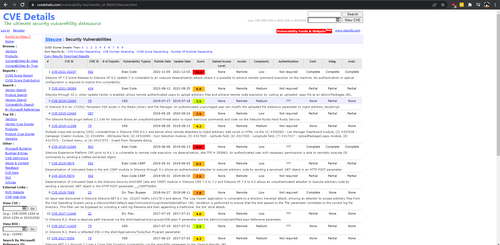

# Challenge

**Name:** CVE  
**Category:** OSINT  
**Difficulty:** Easy  
**Author:** Anthony Mentesana  
**Flag:** CVE-2021-42237  

## Description

The UWA Cyber Team has asked you to find out the lastest CVE that may affect the UWA website (uwa.edu.au) using OSINT tools  
**Hint** What CMS is in use?  

## Solution

You can use wappalyzer to find out that the website is ran by Sitecore.  
https://www.wappalyzer.com/lookup/uwa.edu.au  
You can then search Sitecore CVE and the top result CVE-2021-42237 is the flag.  
https://www.cvedetails.com/vulnerability-list/vendor_id-9609/Sitecore.html  

  
  