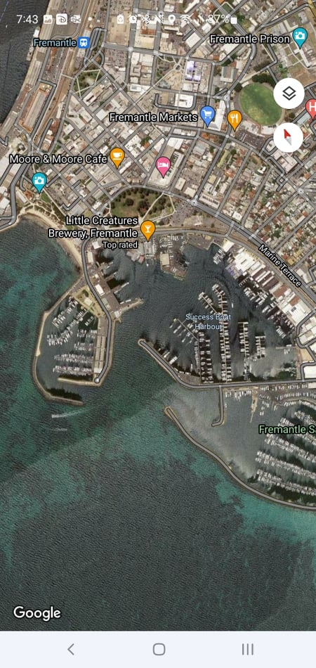
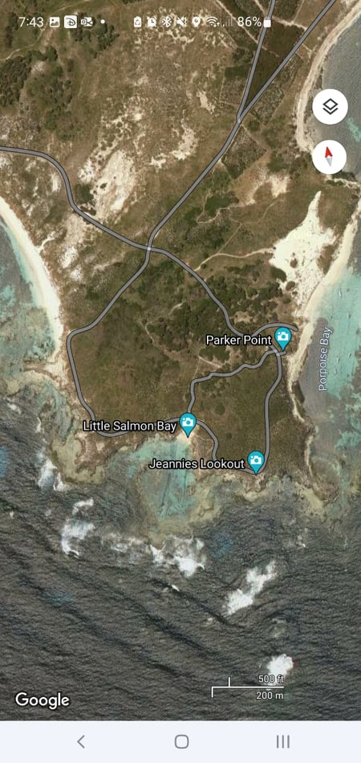
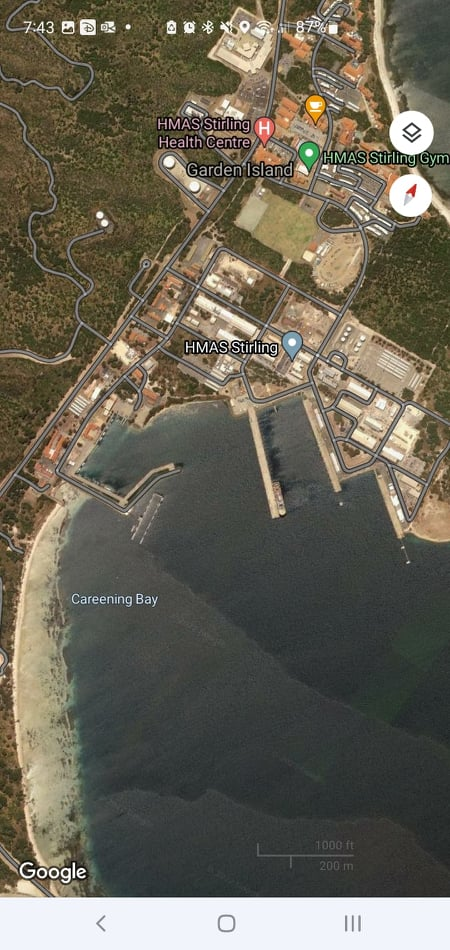

# Challenge

**Name:** Surveillance Missions

**Category:** Web

**Author:** Chris Fitzsimons (Fitzy)

---

**Name Part A:** Surveillance Mission #1

**Difficulty Part A:** Easy

**Flag Part A:** Success Boat Harbour OR Fremantle

## **Description Part A:**

This image has been taken on a surveillance mission by a State Actor. Are you able help the team find Location of this image? 
**Hint** The Location is in Western Australia.

## **Solution Part A:**

Based on the boats and the formation of the jetti's / land formation it is clear that this is Fremantle.
If you can distinguish this you can look at google maps and search for the specific formation and you can find it quickly.

---

**Name Part B:** Surveillance Mission #2

**Difficulty Part B:** Medium

**Flag Part B:** Jeannies Lookout OR Little Salmon Bay

## **Description Part B:**

Beause you did so well with out first request, We have recieved another image that has been taken on a surveillance mission by a State Actor. Are you able help the team find Location of this image?
**Hint** The Location is in Western Australia.

## **Solution Part B:**

From the shape of the rock formation and the fact that this is an Island it narrows down the possability. There is only two options this can be. Garden Island and Rottnest Island.
You can then look on google map and find the exact area in the photo.

---

**Name Part C:** Surveillance Mission #3

**Difficulty Part C:** Medium

**Flag Part C:** Careening Bay OR HMA Stirling

## **Description Part C:**

I feel like their surveillance mission is getting closer to our HQ. Can you help the team find Location of this image before they organise an attack?
**Hint** The Location is in Western Australia.

## **Solution Part C:**

You can see this is a ship port. Looking at areas close to the others, There is one known Ship port. That is Garden Island. You can check Google maps and the ports match.

