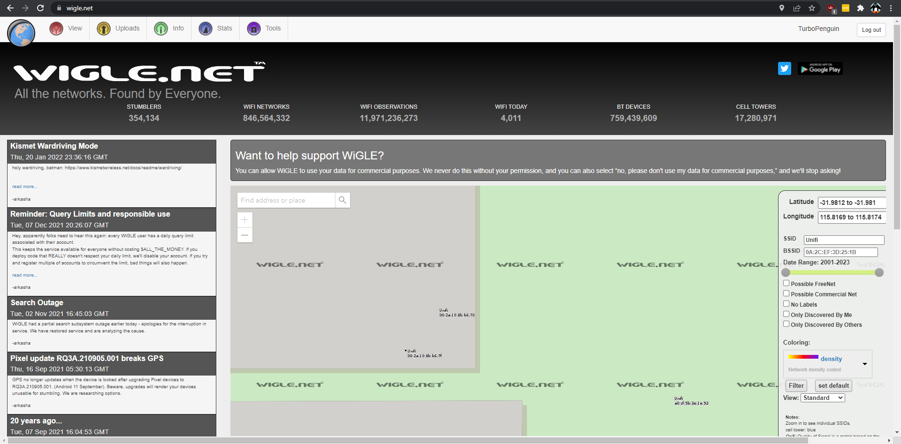

# Challenge

**Name:** Unifi  
**Category:** OSINT  
**Difficulty:** Easy  
**Author:** Chris Fitzsimons (Fitzy)  
**Flag:** 00:2a:10:8b:b6:70 or 00:2a:10:8b:b6:7f  

## Description

Find the BSSID for the Unifi Access Points in the UWA Makers Lab without going to the location.

## Solution

You can search access points using wigle.net (You will need to log in to see the SSID and BSSID).  
Filter SSID Unifi and navigate on the map to the Makers Lab (If you dont know where that is you can search Makers Lab on Google Maps to get the location)  
You will find two access points and their BSSID's. Thoes are the flags.  

