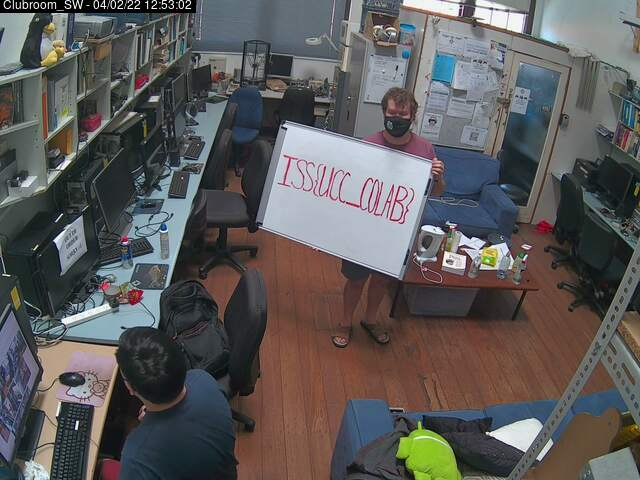

# Challenge

**Name:** GhostCam

**Category:** OSINT

**Difficulty:** Easy

**Flag:** `ISS{UCC_COLAB}`

**Author:** Alex Brown (ghostccamm)

## Description

I was just chilling in the UCC clubroom on the 4th of February, when some weirdo messaged me to let them in at around 12:50 pm. They were wearing mismatched coloured clothes, a face mask with a beaver on it, dad sandals and a massive whiteboard. All he did was just stand in the middle of the club room for a few minutes then left. What a bizarre experience!

The whiteboard had some writing on it, but I completely forgot what it said! 

**Can you find a way to see the text on the whiteboard?**

## Solution

Checking the UCC website, we can see that they have a webcam service that allows view inside the UCC club room. Checking the archives at around 12:50 pm on the 4th of February, we can see this weird monga holding whiteboard at 12:53 PM. The page is https://webcam.ucc.asn.au/archive.html#1643950426000.

**A big thank you to UCC for providing their clubroom and webcam service to cater this whacky challenge!**

