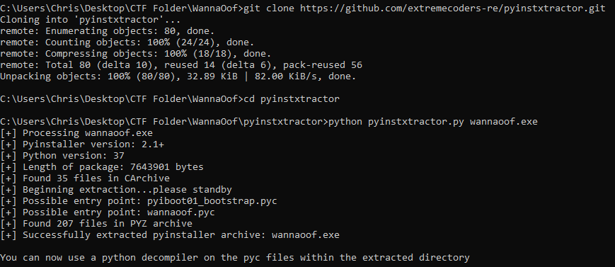
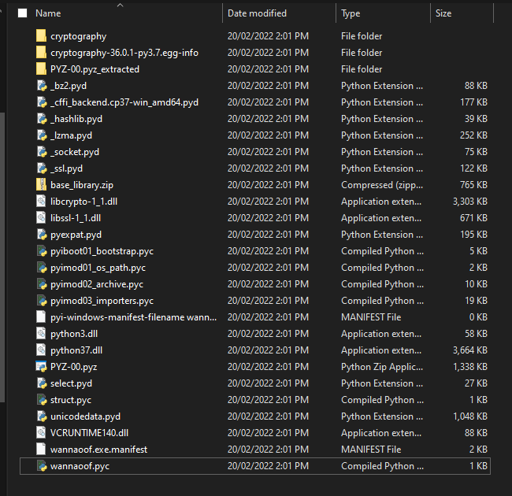
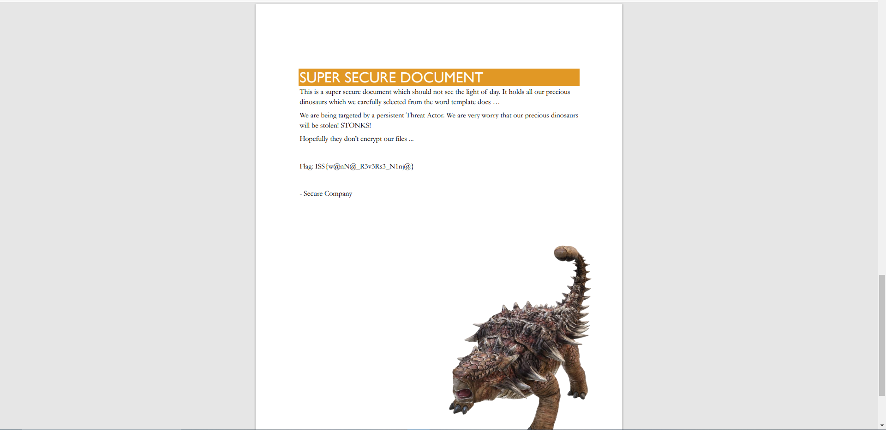

# Challenge

**Name:** WanaOof

**Category:** Reverse

**Author:** Chris Fitzsimons (Fitzy)

---

**Name Part A:** WanaOof #1

**Difficulty Part A:** Easy

**Flag Part A:** ISS{0nLy_fUn_T1m3s_W1th_F3rn3t!}

## **Description Part A:**

Help! All our Secure Documents have been encrypted with no ransom! We managed to find a .exe file on the devices desktop but we dont know what to do with it. Can you help us find out how these files were encrypted and what key the script uses!  

## **Solution Part A:**

Using pyinstxtractor we can extract the contents of the pyinstaller executable file. This will allow us to get to the pyc files which we can decompile for the source code.  
```bash
git clone https://github.com/extremecoders-re/pyinstxtractor.git  
python pyinstxtractor.py wannaoof.exe  
```
https://github.com/extremecoders-re/pyinstxtractor  

After the executable is extracted by pyinstxtractor we can use decompyle3 to decompile the wannaoof.pyc file to see the source code. We can see that the flag is staticly set in the code as the fernet key.  
```bash
pip install decompyle3  
decompyle3 wannaoof.pyc  
```
https://github.com/rocky/python-decompile3  





---

**Name Part B:** WannaOof #2

**Difficulty Part B:** Easy

**Flag Part B:** ISS{w@nN@_R3v3Rs3_N1nj@}  

## **Description Part B:**

Thankyou for reverse engineering the executable to find the key! Can you use your coding skills to decrypt our Secure Doc with the key?

## **Solution Part B:**

Using the Key we got from the previous challange we can create a quick and simple python script which will use the key and fernet to decrypt the file.  
Inside the file will be the flag.  
Example decrypt script in solution.  



