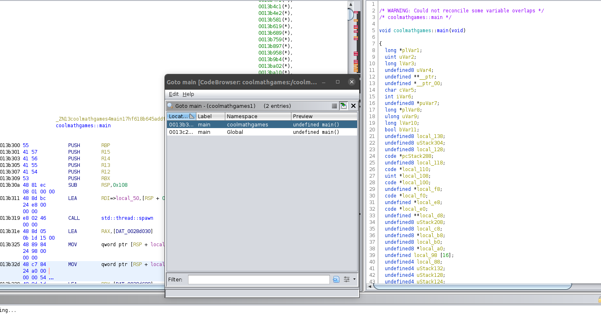
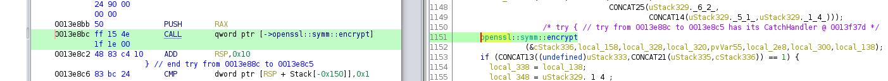

# Challenge

**Name:** Cool Math Games Terminal Edition

**Category:** Reverse Engineering

**Difficulty:** Hard

**Author:** Alex Brown (ghostccamm)

**Flag:** `ISS{i_c4Nn0t_d9_m3tH5_bUtT_aT_l3a5t_tH3_r4n50mWaR3r_c4nNoT_m3k_g00d_dIn4m1c_k3y5!1!}`

## Description

**`Warning!` The provided file is ransomware that will encrypted all `.txt` files in the folder where you execute the program**

I have always struggled with maths for all of my life :(. I cannot even do the most basic calculations such as 1+1!

My friend wanted to help me out and told me that Cool Math Games have a terminal game that will help me learn addition! I was so happy that there was a game that would help me to learn!

However, I could not find the original game so I downloaded one from some website and everything seemed alright at first. But when I failed the first question it said my text files were encrypted and I have to pay a ransom! This is devastating since my `secret.txt` text file was encrypted as well!

Can you find a way to retrieve my `secret.txt`?

## Solution

Analysing the strings within `coolmathgames` we can see the hard coded strings that are used shown below.

```
Your Username: src/main.rsWelcome  to Cool Math Games Terminal Game!Starting in 5 seconds
+=?Hahahaaha you can't even maths!
AS A PUNISHMENT WE HAVE ENCRYPTED YOUR TEXT FILES!To get your text files back meet us outside Reid Library on the 14th of March at 11:00 PM!
One of us will be there with a cardboard sign with 'Get your ransomware keys for $5' on it
Once you have the key input it below. MAKE SURE YOU DON'T DO A TYPO!
Key:/rustc/9d1b2106e23b1abd32fce1f17267604a5102f57a/library/alloc/src/string.rsa Display implementation returned an error unexpectedlycalled `Result::unwrap()` on an `Err` value
[39m
[38;5;1m
[38;5;2m
[38;5;4m
[38;5;5m
[38;5;9m
[38;5;10m
[38;5;13m
[38;5;14m
src/lib.rsCouldn't read input./DD331E79588E6A7F0D896417168C022946F70F2074F5A738212C9EC747F341B2095BC22969B29D6C8E98F1D83DAE50D92A6FDA77AAF45AED81E87D83D14AB16054A48A16BCA56EFC23A2770BDA97E14Fcalled `Result::unwrap()` on an `Err` value/rustc/9d1b2106e23b1abd32fce1f17267604a5102f57a/library/std/src/thread/mod.rsthread name may not contain interior null bytesfailed to spawn threadcalled `Option::unwrap()` on a `None` value/rustc/9d1b2106e23b1abd32fce1f17267604a5102f57a/library/core/src/slice/iter.rs
attempt to divide by zero/home/alex/.cargo/registry/src/github.com-1ecc6299db9ec823/hex-0.4.3/src/lib.rs
```

From this we can tell that:

1. The ransomware was written in rust
2. Symbols weren't stripped
3. In `src/lib.rs` there is a string `DD331E79588E6A7F0D896417168C022946F70F2074F5A738212C9EC747F341B2095BC22969B29D6C8E98F1D83DAE50D92A6FDA77AAF45AED81E87D83D14AB16054A48A16BCA56EFC23A2770BDA97E14` and the `hex` crate was loaded. Meaning that this hex string is probably decode at somepoint.

Running the ransomware in a seperate folder shows that encrypting a file with the same plaintext results in the same ciphertext. This means that the encryption key is static or dynamically static.

Let's load the binary into `radare2` and take a closer look at the binary

```
$ r2 coolmathgames
```

*The following commands are inside the `radare2` interpreter*

First let's analyse the binary then output the functions with

```
aaa
afl
```

There are hundreds of functions since the binary was statically compiled. Instead let's search for the program name in the list of functions

```
[0x0003af79]> afl~coolmathgames
0x0003b300   59 3266 -> 3218 sym.coolmathgames::main::hf618b645addf5e52
0x0003f720    8 88           sym.core::ptr::drop_in_place_std::thread::Builder::spawn_unchecked_coolmathgames::lib::game::setup_game____::_u7b__u7b_closure_u7d__u7d__::h2724a1107bd09500
0x0003cef0   31 520  -> 505  sym.coolmathgames::lib::game::read_line::hf11efd222334cd56
0x0003d130   72 2154 -> 2117 sym.coolmathgames::lib::game::close_game::h840a39a6e68d7fac
0x0003dc30  229 5426 -> 5363 sym.coolmathgames::lib::game::setup_game::hdfa4b7fb015e960d
```

We can see that there are 3 core functions. In main there is

```
sym.coolmathgames::main::hf618b645addf5e52
```

and in lib there is

```
sym.coolmathgames::lib::game::read_line::hf11efd222334cd56
sym.coolmathgames::lib::game::close_game::h840a39a6e68d7fac
sym.coolmathgames::lib::game::setup_game::hdfa4b7fb015e960d
```

It also appears a thread is spawned that executes `sym.coolmathgames::lib::game::setup_game::hdfa4b7fb015e960d`.

Next analyse the assembly for the `main` function.

```
[0x0003b300]> s sym.coolmathgames::main::hf618b645addf5e52
[0x0003b300]> pdf
... A lot of disgusting assembly
```

The assembly is barely readable. Let's try to load the binary into `ghidra` and use that to analyse the source code.

Import `coolmathgames` in ghidra and analyse the file. Next let's go to main by going `Navigation->Goto` and search for `main`.



The decompiled C code is still disgusting, but we can see that a thread is spawned. Using the information we gathered before we can infer that the thread is executing `sym.coolmathgames::lib::game::setup_game::hdfa4b7fb015e960d`.

We can see also that the function is in the `coolmathgames` namespace. Looking at the namespace we can find the other functions that were found in `radare2`.

Having a look at the `setup_game` function, the decompiled still looks disgusting. However, it shows that the `openssl` Rust crate is used and `openssl::symm::encrypt` is called.



Googling the documentation for `openssl::symm::encrypt` (https://docs.rs/openssl/0.10.9/openssl/symm/fn.encrypt.html) the parameters are

```rust
pub fn encrypt(
    t: Cipher, 
    key: &[u8], 
    iv: Option<&[u8]>, 
    data: &[u8]
) -> Result<Vec<u8>, ErrorStack>
```

that is compile to

```c
openssl::symm::encrypt(&cStack336,local_158,local_328,local_320,pvVar55,local_2e8,local_300,local_138);
```

Looking aboce in the function, we can see that `local_158` is the AES_128_CBC cipher.

```c
local_158 = openssl::symm::Cipher::aes_128_cbc();
```

This indicates that we will be looking for a key and initial vector that are 16 bytes long. The other thing is that the other parameters are probably the `key` and `iv` in order.

Now we have a good idea on how the ransomware runs.

1. It spawns a new thread that executes `setup_game`.
2. `setup_game` executes `openssl::symm::encrypt`, meaning that you can execute the ransomware using a debugger and insert a breakpoint when `encrypt` is called.

Using `gdb`, you can retrieve the key and iv by inserting a breakpoint at `encrypt` and printing the values for `$rdx` and `$r8` (registers that are storing the key and iv).

```
$ gdb ./coolmathgames 
GNU gdb (Ubuntu 9.2-0ubuntu1~20.04.1) 9.2
Copyright (C) 2020 Free Software Foundation, Inc.
License GPLv3+: GNU GPL version 3 or later <http://gnu.org/licenses/gpl.html>
This is free software: you are free to change and redistribute it.
There is NO WARRANTY, to the extent permitted by law.
Type "show copying" and "show warranty" for details.
This GDB was configured as "x86_64-linux-gnu".
Type "show configuration" for configuration details.
For bug reporting instructions, please see:
<http://www.gnu.org/software/gdb/bugs/>.
Find the GDB manual and other documentation resources online at:
    <http://www.gnu.org/software/gdb/documentation/>.

For help, type "help".
Type "apropos word" to search for commands related to "word"...
Reading symbols from ./coolmathgames...
gdb-peda$ b encrypt
Breakpoint 1 at 0x43820
gdb-peda$ r

...

Thread 2 "coolmathgames" hit Breakpoint 1, 0x00007ffff7e18820 in openssl::symm::encrypt ()
gdb-peda$ x/16xb $rdx
0x7ffff7fff2a0:	0xb1	0xdf	0x09	0x79	0xc7	0x0f	0x87	0x6f
0x7ffff7fff2a8:	0xae	0x55	0xfb	0xd8	0x7d	0xb5	0x53	0xbb
gdb-peda$ x/16xb $r8
0x7ffff7fff320:	0xf5	0xff	0x8b	0x7f	0xff	0xaf	0xef	0xff
0x7ffff7fff328:	0x01	0xf7	0xff	0x03	0xff	0xb7	0xf3	0xff
```

We can then use `openssl` to decrypt `secret.txt`

```
$ openssl enc -d -aes-128-cbc -K b1df0979c70f876fae55fbd87db553bb -iv f5ff8b7fffafefff01f7ff03ffb7f3ff -in secret.txt
My biggest secret is I have no idea what 2+2 is equal to...

ISS{i_c4Nn0t_d9_m3tH5_bUtT_aT_l3a5t_tH3_r4n50mWaR3r_c4nNoT_m3k_g00d_dIn4m1c_k3y5!1!}
```