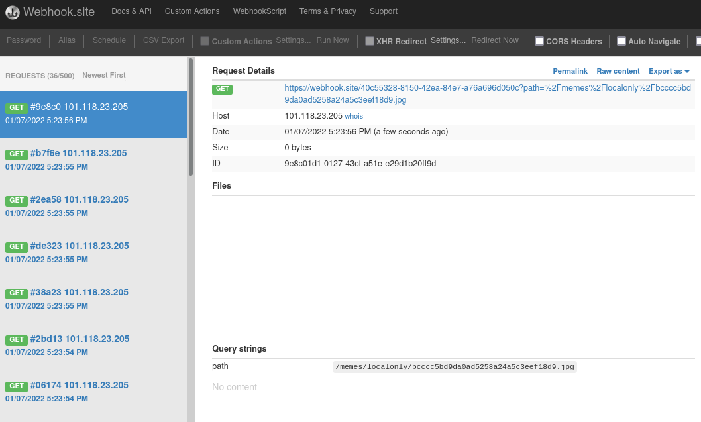

# Challenge

**Name:** MemeDB

**Category:** Web

**Author:** Alex Brown (ghostccamm)

**Provided Files:** [web_memedb.zip](./publish/web_memedb.zip)

---

**Name Part A:** MemeDB Part A: Secure Memes

**Difficulty Part A:** Medium

**Flag Part A:** `ISS{tH3_m3m3m35_cAv5eD_tH3_l3aK!1!}`

---

**Name Part B:** MemeDB Part B: Leaked Memes

**Difficulty Part B:** Hard

**Flag Part B:** `ISS{GOOFING YOUR NGINX CONFIG AND HAVING A XS VULN LEADS TO STOLEN MEMES}`

## Description (Add to top of challenge descriptions)

We are collectors of the juicest, finest and dankest memes that the internet has to offer. We are currently developing a website for sharing and submitting memes using a scalable API. However, we haven't migrated to cloud services yet so we have just configured NGINX to route the traffic for now.

Can you test the secret of MemeDB? We have some super dank memes that we want to **only share locally** within our organisation and do not want them to be **leaked**.

---

### Description: Part A

*Steal the secret passcode that is hardcoded into the source code to get the flag for Part A.*

---

### Description: Part B

*View the secret super dank meme that is only supposed to be shared internally to get the flag for Part B.*

## Solution: Part A

Reviewing the NGINX config for the challenge (shown below), a slash is missing at the end of the `/memes` location and `alias` is used to define a replacement for the specified location. 

```nginx
server {
    listen 4242;
    server_name _;

    proxy_set_header  Host $host;
    proxy_set_header  X-Real-IP $remote_addr;

    location / {
        index index.html;
        root /app/html;
    }

    location /memes {
        alias /app/memes/;
    }

    location /api/ {
        include proxy_params;
        proxy_pass http://unix:/tmp/webapi.sock;
    }
}
```

This is vulnerable to [Off-by-Slash](https://blog.detectify.com/2020/11/10/common-nginx-misconfigurations/). This can be exploited by going to `/memes../app.py` on the website and NGINX will return the file at `/memes/../app.py`, leaking the source code for the Web API. Inside the source code you can see the passcode is `ISS{tH3_m3m3m35_cAv5eD_tH3_l3aK!1!}`.

## Solution: Part B

The goal is to find the new URL path to the topsecret meme located inside of `/memes/localonly`. There is an API path at `/api/topsecretmemes/search`, but it can only be accessed from the local machine directly. There are no XSS vulnerabilities on the page. There is no Cross Origin Read (COR) policy and therfore data can not be sent by loading content from the API and then exfiltrated to an external website.

The trick here is noticing the different status codes that are returned by the web api and how the browser responds to them. If the API finds a row that matches the query, then a 200 status code is returned. Otherwise, the API will respond with a 404 status code indicating that there are no results. Since the API is a REST API and the content are JSON documents, you can succesfully load them within the DOM as a script block shown below. However, an error is thrown if the API responds with a 404 status code.

```html
<script src="http://127.0.0.1:4242/api/topsecretmemes/search?q=memes"></script>
```

This behaviour results in a Cross-Site Leak (XS Leak) vulnerability (which is a type of side-channel attack), where you can leak a value using a search query character by character. You can load script blocks within the DOM, testing each possible character until the API responds with a 200 status code. Once you have successfully loaded a script block, you know a character in a successful search that implies the character is in the path for the top secret meme. To get the full path, you'll need to continue appending values by using the script block loading method explained above.

The only protection against this attack client side is that the Chrome browser (the one the reviewer is using) has a built in Cross Origin Read Block (CORB) feature ([source](https://www.chromium.org/Home/chromium-security/corb-for-developers)). However, the developers have configured the NGINX server to add the `X-Content-Type-Options nosniff` that forces the browser to accept the response content type and not try to detect it. It is a recommended security header to mitigate XSS attacks, but enables the XS attack since the CORB cannot properly detect the content type of the JSON responses from the API and recognise that data is being dubiously exfiltrated to an external website.

To exploit the vulnerability, create a html file that runs javascript code that will exfiltrate the value for the path character by character, [like the one in the solution](./solution/payload.html). You can host the html document on a free web hosting service (there are plenty that do this) and make the reviewer visit it. Once your payload is hosted, send the url as a meme to be reviewed using the website and the reviewer will visit your malicious website.



In the example above, it leaks that the path to the secret meme is `/memes/localonly/bcccc5bd9da0ad5258a24a5c3eef18d9.jpg`. Just visit the page and you will see the meme with the flag on it.

## How to run

**Required Ports Open:** 4242

* Run `dev_docker.sh` to run a development build for testing the frontend.
* Run `start_docker.sh` to just build and run the challenge.